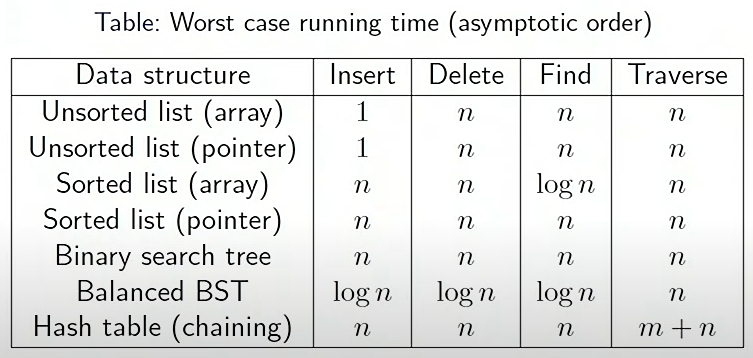
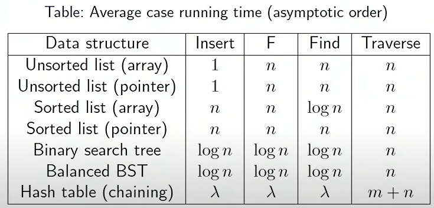
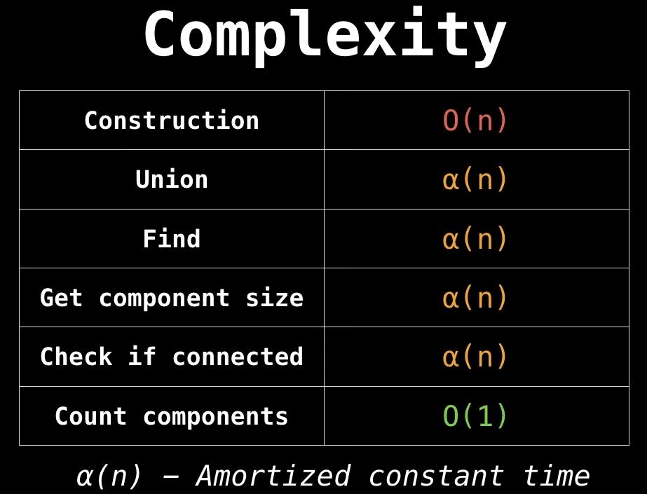

# Resources to use for studying CS5301 @ Baylor

###### [Parent Directory Link](../README.md)

*Table of Contents*
1. [Module 1](#module-1---algos-and-analysis)
2. [Module 2](#module-2---divide-and-conquer)
3. [Module 3](#module-3---quicksort)
4. [Module 4](#module-4---linear-time-selection-and-graphs)
5. [Module 5](#module-5---graph-search-pathing-and-strongly-connected-components-sccs)
6. [Module 6](#module-6---focus-on-djikstras-and-heaps)
7. [Module 8](#module-8---redblack-trees-hash-tables-bloom-filters)
8. [Module 9](#module-9---greedy-algorithms)
9. [Module 10](#module-10---kruskals-and-disjoint-sets)
1. [Extra Notes](#extra-notesdynamic-programming)
8. [Class Notes](#class-notes)

*__need to figure out nesting lists__*

## Module 1 - Algo's and Analysis
---
Basic overview of what algorithms are and how to do analysis on those algorithms.
---
### Asymptotic Analysis Resources

[Video #1](https://www.youtube.com/watch?v=f_IaKCB7Zo8&ab_channel=NesoAcademy)

[Big O and Little O notation](https://www.tutorialspoint.com/difference-between-big-o-and-little-o-notation)

---
### First Algorithms - Merge Sort

[GeeksForGeeks Regular Mergesort](https://www.geeksforgeeks.org/merge-sort/)

[GeeksForGeeks 3-way Mergesort](https://www.geeksforgeeks.org/3-way-merge-sort/)

[Mergesort Code Video](https://www.youtube.com/watch?v=TzeBrDU-JaY&t=507s&ab_channel=mycodeschool)

[Mergesort Analysis video](https://www.youtube.com/watch?v=0nlPxaC2lTw&ab_channel=mycodeschool)

---
## Module 2 - Divide and Conquer
---
## Module 3 - Quicksort
---
## Module 4 - Linear time Selection and Graphs
---
## Module 5 - Graph Search, pathing, and Strongly connected components (SCC's)
---
## Module 6 - Focus on Djikstra's and heaps

[Implement Min-heap](https://www.youtube.com/watch?v=UTrr0B4ny9s&ab_channel=CoffeeBeforeArch)

[Heap operations and Applications](https://www.youtube.com/watch?v=mNYHDv7SbDI&ab_channel=StanfordAlgorithms)

[Binary Search Tree (BST)](https://www.youtube.com/watch?v=JfSdGQdAzq8&ab_channel=WilliamFiset)

[BST Insertion](https://www.youtube.com/watch?v=LwpLXm3eb6A&ab_channel=WilliamFiset)

[BST Removal](https://www.youtube.com/watch?v=8K7EO7s_iFE&ab_channel=WilliamFiset)

[BST Traversal](https://www.youtube.com/watch?v=k7GkEbECZK0&ab_channel=WilliamFiset)

[Balanced BST(or BBST)](https://www.youtube.com/watch?v=q4fnJZr8ztY&ab_channel=WilliamFiset)

### AVL Node Code from GeeksForGeeks

[Code sample from GfG](https://www.geeksforgeeks.org/avl-tree-set-1-insertion/?ref=leftbar-rightbar)

```c++
// C++ program to insert a node in AVL tree
#include<bits/stdc++.h>
using namespace std;

// An AVL tree node
class Node
{
	public:
	int key;
	Node *left;
	Node *right;
	int height;
};

// A utility function to get maximum
// of two integers
int max(int a, int b);

// A utility function to get the
// height of the tree
int height(Node *N)
{
	if (N == NULL)
		return 0;
	return N->height;
}

// A utility function to get maximum
// of two integers
int max(int a, int b)
{
	return (a > b)? a : b;
}

/* Helper function that allocates a
new node with the given key and
NULL left and right pointers. */
Node* newNode(int key)
{
	Node* node = new Node();
	node->key = key;
	node->left = NULL;
	node->right = NULL;
	node->height = 1; // new node is initially
					// added at leaf
	return(node);
}

// A utility function to right
// rotate subtree rooted with y
// See the diagram given above.
Node *rightRotate(Node *y)
{
	Node *x = y->left;
	Node *T2 = x->right;

	// Perform rotation
	x->right = y;
	y->left = T2;

	// Update heights
	y->height = max(height(y->left),
					height(y->right)) + 1;
	x->height = max(height(x->left),
					height(x->right)) + 1;

	// Return new root
	return x;
}

// A utility function to left
// rotate subtree rooted with x
// See the diagram given above.
Node *leftRotate(Node *x)
{
	Node *y = x->right;
	Node *T2 = y->left;

	// Perform rotation
	y->left = x;
	x->right = T2;

	// Update heights
	x->height = max(height(x->left),
					height(x->right)) + 1;
	y->height = max(height(y->left),
					height(y->right)) + 1;

	// Return new root
	return y;
}

// Get Balance factor of node N
int getBalance(Node *N)
{
	if (N == NULL)
		return 0;
	return height(N->left) - height(N->right);
}

// Recursive function to insert a key
// in the subtree rooted with node and
// returns the new root of the subtree.
Node* insert(Node* node, int key)
{
	/* 1. Perform the normal BST insertion */
	if (node == NULL)
		return(newNode(key));

	if (key < node->key)
		node->left = insert(node->left, key);
	else if (key > node->key)
		node->right = insert(node->right, key);
	else // Equal keys are not allowed in BST
		return node;

	/* 2. Update height of this ancestor node */
	node->height = 1 + max(height(node->left),
						height(node->right));

	/* 3. Get the balance factor of this ancestor
		node to check whether this node became
		unbalanced */
	int balance = getBalance(node);

	// If this node becomes unbalanced, then
	// there are 4 cases

	// Left Left Case
	if (balance > 1 && key < node->left->key)
		return rightRotate(node);

	// Right Right Case
	if (balance < -1 && key > node->right->key)
		return leftRotate(node);

	// Left Right Case
	if (balance > 1 && key > node->left->key)
	{
		node->left = leftRotate(node->left);
		return rightRotate(node);
	}

	// Right Left Case
	if (balance < -1 && key < node->right->key)
	{
		node->right = rightRotate(node->right);
		return leftRotate(node);
	}

	/* return the (unchanged) node pointer */
	return node;
}

// A utility function to print preorder
// traversal of the tree.
// The function also prints height
// of every node
void preOrder(Node *root)
{
	if(root != NULL)
	{
		cout << root->key << " ";
		preOrder(root->left);
		preOrder(root->right);
	}
}

// Driver Code
int main()
{
	Node *root = NULL;
	
	/* Constructing tree given in
	the above figure */
	root = insert(root, 10);
	root = insert(root, 20);
	root = insert(root, 30);
	root = insert(root, 40);
	root = insert(root, 50);
	root = insert(root, 25);
	
	/* The constructed AVL Tree would be
				30
			/ \
			20 40
			/ \ \
		10 25 50
	*/
	cout << "Preorder traversal of the "
			"constructed AVL tree is \n";
	preOrder(root);
	
	return 0;
}

// This code is contributed by
// rathbhupendra

```

---
## Module 8 - Red/Black Trees, Hash Tables, Bloom filters

[R/B Tree Classes](https://www.youtube.com/watch?v=-qjrcxVmf2Q&ab_channel=RobEdwards)

```c++
public class RedBlackTree<k,v> {
private:
	Node <k,v> root;
	int size;

public:
	class Node<k,v>{
		k key;
		v value;
		Node<k,v> left, right, parent;
		boolean isLeftChild, isBlack;

		Node(K key, V value){
			this.key = key;
			this.value = value;
			left = right = parent = null;
			this.isBlack = false;
			this.isLeftChild = false;
		}
	}
}
```

[R/B Add Method](https://www.youtube.com/watch?v=p8TSYkDz0eI&ab_channel=RobEdwards)

```c++
public void add(k key, v value){
	Node<k,v> node = new Node<k,v>(key, value);

	if(root == null){ //Checking if insert is root value
		root = node;
		root.black = true;
		size++;
		return;
	}

	add(root, node) //calling the private function inside the public
	size++;


}

private void add(Node<k,v> parent, node<k,v> newNode){
	if(newNode.key > parent.key){
		if(parent.right == null){
			parent.right = newNode;
			newNode.parent = parent;
			newNode.isLeftChild = false;
		} else {
			add(parent.right, newNode); //recurse down right if right is not empty
		}
	} else {
		if(parent.left == null){
			parent.left = newNode;
			newNode.parent = parent;
			newNode.isLeftChild = true;
		} else {
			add(parent.left, newNode); //recurse down left if left is not empty
		}
	}
	checkColor(newNode) //this would be an additional method that needs to be written, part of making it a R/B tree
}
```

[Checking R/B Tree violations](https://www.youtube.com/watch?v=pJWAi6u7Nq4&ab_channel=RobEdwards)

```c++
public void checkColor(Node<k,v> node){
	if(node == root){
		return;
	}

	if(!node.black && !.node.parent.black){
		correctTree(node);
	}

	checkColor(node.parent);

}

public void correctTree(Node<k,v> node){
	if(node.parent.isLeftChild){
		//aunt will be node.parent.parent.right
		if(node.parent.parent.right == null || node.parent.parent.right.isblack){
			rotate(node);
		} else {
			colorFlip(node, true);
		}
	} else {
		if(node.parent.parent.left == null || node.parent.parent.left.isblack){
			rotate(node);
		} else {
			colorFlip(node, false);
		}
	}
}

public void colorFlip(Node<k,v> node, isRight){
	if(isRight){
		if(node.parent.parent.right != null){
			node.parent.parent.right.isBlack = true; //Setting right aunt to black
		}
	} else {
		if(node.parent.parent.left != null){
			node.parent.parent.left.isBlack = true; //Setting left aunt to black
		}
	}
	node.parent.parent.isBlack = false //setting grandparent to red
	node.parent.isBlack = true //setting parent to black
}
```

[Rotate method](https://www.youtube.com/watch?v=IuG3WSaDumc&ab_channel=RobEdwards)

```c++
public void rotate(Node<k,v> node){
	if(node.isLeftChild){ //Handling a left child node
		if(node.parent.isLeftChild){
			rightRotate(node.parent.parent);
			node.isBlack = false;
			node.parent.isBlack = true;
			if(node.parent.right != null){
				node.parent.right.isBlack = false;
			}
		} else {
			rightLeftRotate(node.parent.parent);
			node.isBlack = true;
			node.right.isBlack = false;
			node.left.isBlack = false;
		}
	}
	else {
		if(!node.parent.isLeftChild){ //Handling a right child node
			leftRotate(node.parent.parent);
			node.isBlack = false;
			node.parent.isBlack = true;
			if(node.parent.left != null){
				node.parent.left.isBlack = false;
			}
		} else {
			leftRightRotate(node.parent.parent);
			node.isBlack = true;
			node.right.isBlack = false;
			node.left.isBlack = false;
		}
	}
}
```

__*need to finish r/b videos*__

[Hash Table intro](https://www.youtube.com/watch?v=Qu183GFHbZQ&ab_channel=StanfordAlgorithms)

[Interesting hash tables using golang](https://www.youtube.com/watch?v=zLnJcAt1aKs&ab_channel=JunminLee)

[Hash Table and Hash Functions](https://www.youtube.com/watch?v=KyUTuwz_b7Q&ab_channel=ComputerScience)

[Universal Hasing](https://www.youtube.com/watch?v=3LuaY18-BR8&ab_channel=MarkC.Wilson)





[Bloom Filters](https://www.youtube.com/watch?v=bEmBh1HtYrw&ab_channel=YoavFreund)

---

## Module 9 - Greedy Algorithms

[Greedy Algo resource](https://www.programiz.com/dsa/greedy-algorithm)

[Greedy video 1 - Total weighted time to completion](https://www.youtube.com/watch?v=WJpxJXzahIQ&ab_channel=TimKearns)

[Greedy video 2 - Exchange proof](https://www.youtube.com/watch?v=qG0UfYTmN_Y&ab_channel=TimKearns)

Prim's Videos
- [Lazy](https://www.youtube.com/watch?v=jsmMtJpPnhU&t=364s&ab_channel=WilliamFiset)
	- Uses a basic Priority queue
- [Eager](https://www.youtube.com/watch?v=xq3ABa-px_g&ab_channel=WilliamFiset)
	- Uses an INDEXED priority queue
	- This is a hash table mixed with a minimum priorty queue
	- Requires relaxing edges
		- Relaxing here means replacing edges if the new edge has a lower cost than the old edge
	- TODO: Need to write psuedo code from this video

Primms Lazy Pseudocode
```python
function lazyPrims(s=0):
	m = n-1 #number of edges in MST
	edgeCount, mstCost = 0, 0
	mstEdges = [null,...,null] #size m

	addEdges(s)

	while(!pq.isEmpty() and edgeCount != m):
		edge = pq.dequeue()
		nodeIndex = edge.to

		if visited[nodeIndex]:
			continue

		mstEdges[edgeCount++] = edge #this adds to mstEdges AND increments edgecount at the same time
		mstCost += edge.cost

		addEdges(nodeIndex)
	
	if edgeCount != m:
		return(null, null) #case for no MST existing
	
	return (mstCost, mstEdges)
```
```python
function addEdges(nodeIndex):
	#mark the current node as visited
	visited[nodeIndex] = true

	#Iterate over all edges going out from current node.
	#Add edges to the PQ which point to an unvisited node.
	edges = g[nodeIndex]
	for(edge:edges):
		if !visited[edge.to]:
			pq.enqueue(edge)
```

[Diff between Dijkstra's and Prim's](https://www.youtube.com/watch?v=K_1urzWrzLs&ab_channel=BackToBackSWE)

[Proof of Prims MST](https://www.youtube.com/watch?v=UfhUr5QzfiI&ab_channel=TimKearns)

[Time-Slot Problem - Greedy Solution](https://www.youtube.com/watch?v=BWlXudP7Unk&ab_channel=CourseGrinder)

[Huffman encoding - Data compression](https://www.youtube.com/watch?v=5riYFDldeOY&ab_channel=SunilDhimal)

---

## Module 10 - Kruskals and disjoint sets

### Kruskal's

[Kruskals #1](https://www.youtube.com/watch?v=5xosHRdxqHA&ab_channel=BoQian)

[Kruskal's Proof by Contradiction](https://www.youtube.com/watch?v=_N9Qz0IzxaA&ab_channel=NatarajanMeghanathan)

[Kruskals #2](https://www.youtube.com/watch?v=JZBQLXgSGfs&ab_channel=WilliamFiset)

How does Kruskal's work?
1. Sort edges by ascending edge weight
2. Walk through sorted edges and look at the two nodes the edge belongs to.
	- if the nodes are in the same union, continue
	- if the nodes ARE NOT in the same union, add them to the set, and unify the nodes
3. Terminate when all edges processed OR all vertices have been vistied

### Union Find/Disjoint set

[Intro](https://www.youtube.com/watch?v=ibjEGG7ylHk&ab_channel=WilliamFiset)

Notes:
- Union find is a data structure that tracks elements
	- Elements are split into one or more disjoint sets
- Two primary operations
	1. find
		- Finds what group that element belongs to
	2. union
		- merges two groups together
- Where is it used?
	- Kruskal's MST
	- Grid percolation
	- network connectivity
	- least common ancestor in a tree
	- image processing
- Complexity:
	- 

### MST Applications

[Clustering applications/problems](https://www.youtube.com/watch?v=MSSzOs1X4K8&ab_channel=StanfordAlgorithms)

Clustering problem:
- Goal
	- Given n "points"
		- Webpages, images, fragments, etc
	- Cluster them into coherent groups
- Assumptions
	- as input, given a (dis)similarity measure
		- a distance between point pairs
		- Example: Eucledian distance, some numerical similarity, possibly hash comparing?
	- symmetric measures
- Final
	- Same cluster -> 'nearby'
- Points -> verticies
- Distance -> edge costs
- Point pairs -> edges

---


## Extra notes/Dynamic Programming

[Max Sum contiguous subarray example 1](https://www.youtube.com/watch?v=9lMnCiRSNCg&ab_channel=Studytonight)

[Max Sum contiguous subarray example 2](https://www.youtube.com/watch?v=2MmGzdiKR9Y&ab_channel=BackToBackSWE)

*Max Contiguous notes*:
- use the max() function to compare to previous
- if chose first item, array length resets
- if chose second item for max, array length increments
- can use array length variable to recreate the max contiguous window

## Class Notes

### 2022-06-23 - Midterm I Review

Option for problems: [Competitive programming problems](https://open.kattis.com/)

- *need to rewrite from written notes here*
- *start with exam answers*
- *then go to tool box notes*

### 2022-06-29 - Random

[Exchange Argument reference](https://people.cs.pitt.edu/~kirk/cs1510/notes/greedynotes.pdf)

### 2022-07-06 - Exam II Prep

- Kruskals is last thing that might make it on the test
- Focus on 6 8 and 9, and maybe a little of 10
- Be prepared to draw a lot more graphs
- going to be about 5 questions

### 2022-07-20 - Exam II review

*see notes in concepts*
*possibly import over after the fact*

[Knapsack problem option](https://www.geeksforgeeks.org/0-1-knapsack-problem-dp-10/)
=======