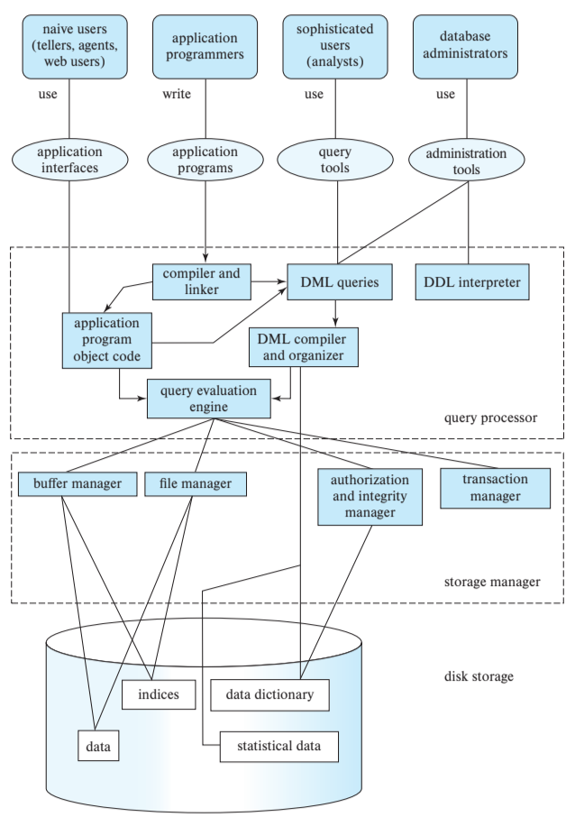

# START HERE

###### [Parent Directory Link](../README.md)

## TOC
1. [Week 1](#week-1)
    - [RDBMS](#rdbms)
    - [Tables](#tables)
    - [Data Types](#data-types)
    - [Keys](#keys)
    - [Relationships](#relationships)
    - [Schemas](#schemas)
    - [Examples](#more-examples)
1. [Week 2](#week-2)
    - [SELECT](#select-clause)
    - [Aggregate Functions](#aggregate-functions)

## Week 1
### **RDBMS**
###### [TOC](#toc)
A 'database' is a repo designed for organizing and accessing information.

Software for database is called 'Database managment system' or DBMS.  The most common type is a 'Relational' DBMS, or RDBMS. These will all speak the common language of SQL, or Structured query language.

*NOTE* - Not all RDBMS follow SQL exactly so always double check syntax with documentation for that specific RDBMS.

SQL is three major parts
- Datamanipulation language (DML)
  - Used to store and retrieve data
- Data description language (DDL)
  - Used to define the structure of the data(schema)
- Data control language (DCL)
  - used to restrict and control access to the data

Some extra notes on RDBMS...
- Provides...
  - Atomicity
    - Means either everything happens or nothing happens for a transaction
  - Consistency
    - Means all contraints are true after a transaction commits/completes
  - Isolation
    - Means every transaction can pretend like it is the only transaction
  - Durability
    - means when updates are made and comitted, they become permanant
  - Security
    - Means that access is controlled
- All of this cannot be provided by a typical file system without large amounts of custom application building

*High Level System Architecture*
|Component|Description|
|---|---|
|User Interface|Provides access to an outside user, highest level of abstraction|
|Transaction Manager|Responsible for setting up the units of work within a transaction, coordinating between users available connections, etc.|
|Query Processor|Processes and optimizes query commands.  This makes SQL commands run faster than a naive/basic implementation would allow|
|Storage Manager|Stores and retrieves data from either external disks or from 'cloud' based stroage BLOBs|

### **Tables**
###### [TOC](#toc)
Tables are made up of *rows* and *columns* and have a unique name for the database.

Each *row* counts as a single *record* in the table

Tables can be empty (i.e. zero rows)

Each *column* is also called a *field*

Tables can be called *relation* as well, but a relation cannot contain duplicate rows.

A row can also be called a *tuple*

A column can also be called an *attribute*

Representing a table:
```sql
vendors(vendorID, companyName, repFirestName, repLastName, referredBy)
```

### **Data Types** 
###### [TOC](#toc)
- Character Strings
  - Character[(L)]
    - Fixed length of 'L'
    - Abbreviated as CHAR
    - Includes trailing spaces up to L
    - Literlas are input with single quotes such as ```'Bob'``` or ```'Bob's Burgers'```
      - Apostrophes require two single quotes to appear
  - Character Varying[(L)]
    - Variable length version of CHAR
    - Abbreviated as VARCHAR
    - Does not include trailing spaces
    - Usually there is an upper limit on this datatype
  - National Character
    - Used for representing non-ascii characters such as Unicode
    - Abbreviated NCHAR or NCHAR VARYING
    - prefix input with an 'N' such as ```N'Bob'```
  - Character Large Object
    - Used for large character array's
    - Abbreviated CLOB
    - Can also be NCLOB
- Numeric
  - Integer, Smallint, and Bigint
    - Store signed, whole numbers
    - Ranges:
      - SMALLINT <= INT <= BIGINT
  - Numeric[(P,[S])] and Decimal([P,[S]])
    - Used for fixed point number representation
    - P specifies total number of digits
    - S specifies number of digits to right of decimal
    - Example: ```NUMERIC(5,2)``` can represent -999.99 to 999.99
    - Can be abbreviated as DEC
    - Exceeding the range results in truncation
    - Can input under range without problem
  - Real and Double Precision
    - REAL specifies single precesion floating point defined by the DBMS
  - Float[(P)]
    - P specifies number of binary digits
  - For real, Double, and Float -> Values can be input with scientific notation (i.e. 7.4E-3)
- Temporal
  - Datetime
    - Date
      - sotres year, month, day
      - Literal: ```DATE'YYY-MM-DD'```
    - Time
      - stores hour, minute, second
      - Literal: ```TIME'HH:MM:SS'```
    - Timestamp
      - stores year, month, day, hour, minute, second
      - Literal: ```TIMESTAMP'YYY-MM-DD HH:MM:SS'```
    - Time and Timestamp may include timezone information
      - DBMS documentation will include this info
  - Interval
    - Year-Month
      - Can be expressed as INTERVAL YEAR, INTERVAL MONTH, INTERVAL YEAR TO MONTH
    - DAy-Time
      - Expressed in days, hours, minutes, seconds
      - INTERVAL \<start value> TO \<stop value>
    - Interval Examples:
      |Type|Example Literal|Description|
      |---|---|---|
      |year-month|INTERVAL '5' YEAR|5 years
      ||INTERVAL '2' MONTH|2 months|
      ||INTERVAL '3-1' YEAR TO MONTH| 3 years and 1 month|
      |---|---|---|
      |Day-time|INTERVAL '5 10:30:22.5' DAY TO SECOND|5 days, 10 hours, 30 minutes, and 22.5 second|
      ||INTERVAL '-5' DAY|5 days ago|
      ||INTERVAL '2 18:00' DAY TO MINUTE|2 days and 18 minutes|
- Binary
  - Bit[(L)]
    - Specifies fixed length binary string containing exactly 'L' bits
    - Inserting fewer than L bits is system specific
  - Bit Varying(L)
    - variable length of Bit(L)
  - Binary Large Object[(L)]
    - Specifies a large **AND** variable length Binary string
    - May hold up to 'L' **BYTES**
    - May be abbreviated as BLOB
- Boolean
  - BOOLEAN
    - Can be True, false, or unknown
- NULL

### **Keys**
###### [TOC](#toc)
**Primary Key** - *PK*
- The *primary key* of a table is a column or set of columns whose values **uniquely** identify a **row**
  - All PK values must be unique
  - PK values *cannot* be NULL
  - Some RDBMS might allow no PK when creating a table, but this is bad practice and should not be used

**Foreign Key** - *FK*
- A *foreign key* is a column or set of columsn in a table that refers to a column or set of columns in some table
  - 'some table' can also refer to the same table aka refer to another row in the same table as the FK is seen
  - example may be that *ingredients.vendorID* refers to *vendors.vendorID*
  - fk vallues Must either...
    - have a matching value in the parent table
    - OR
    - be *null*

### **Relationships**
###### [TOC](#toc)

*One-to-many*
- Each row in **t1** relates to zero or more rows in **t2**
- Each row in **t2** relates to *at most* one row in **t1**
- **t2** will have a FK that references **t1**

*Many-to-many*
- Each row in **t1** relates to zero or more rows in **t2**
- Each row in **t2** relates to zero or more rows in **t1**
- Usually implemented by using 2 *one-to-many* relationships
- Example:
  - 

*One-to-one*
- Special case of a *one-to-many* relationship
- Each row in **t1** relates to *at most* one row in **t2**
- Each row in **t2** relates to *at most* one row in **t1**

### **Schemas**
###### [TOC](#toc)

Schemas are the collection of tables, with relationships and attributes detailed.


*Note:* A schema does **not** include the data for the tables, just information/attributes/pk/fk

### **More Examples**
###### [TOC](#toc)

3 Levels of data abstraction:


Overall System structure:



## Week 2
### **SELECT Clause**
###### [TOC](#toc)
There are some clauses specific to ```SELECT```

```DISTINCT```
- Used to select distinct values with select
- Essentially, elimnates any duplicate values
- It applies to ALL values in the ```SELECT``` clause

```Math operations```
- Can use mathmatecial operators
- ```sql
  SELECT
    H/AB --Note the division here
  FROM
    batting
  WHERE
    playerID='ruthba01'
    AND yearID=1921;
  ```
- Not limited to single statments, can be chain, and can apply to all items in the ```SELECT``` clause

```Shaping Results```
- ```AS```
  - Results from the  ```SELECT``` clause can be shaped with the ```AS``` command
  - Modifies the column title to whatever is input for ```AS```
  - Can also be done without using ```AS```, just need to utilize single quote string literals
  - Multiple items can be shaped this way
- ```CAST()```
  - can cast mathmateical operations to percision and view size as needed
  - example:
    - ```sql
      SELECT 
        CAST(H/AB AS DECIMAL(4,3)) AS 'Some Title' 
      FROM
        ...
      ```
  - The above would result in H/AB being shown as 4 digits long with 3 digits after the decimal

  ```COALESCE```
  - Used to map in a math operator if a value is ```NULL```
  - format would be: ```COALESCE(<value>, <replacementvalue>)```

  ```String Operators```
  - ```CONCAT```
    - Format: ```CONCAT(<string1>, <string2>, ...)```
    - Just does basic concatenation
    - Can also use substrings in the format above
  - ```CASE```
    - Provides a way to check ```SELECT``` inputs against specific cases
    - Example:
      - ```sql
        SELECT playerID, CASE --note case only applies to the following 'WHEN' statment
          WHEN AB / G > 3 THEN 'Reg' --case to check agains
          ELSE 'Sub' --else condition if case not true
          END as type
        FROM batting
        WHERE teamID='DET' AND yearID=2019;
        ```
      
### **Aggregate Functions**
###### [TOC](#toc)
Filler words here

## Week 3
## Week 4
## Week 5
## Week 6
## Week 7
## Week 8
## Week 9
## Week 10
## Week 11
## Week 12
## Week 13
## Week 14
## Week 15