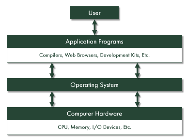
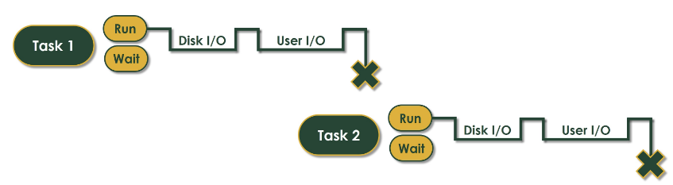
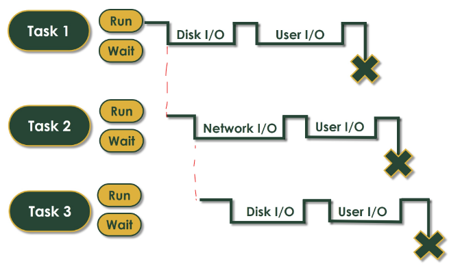
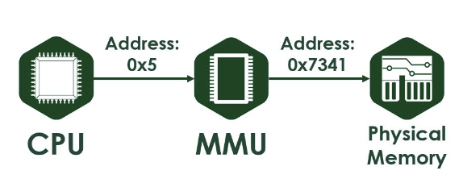
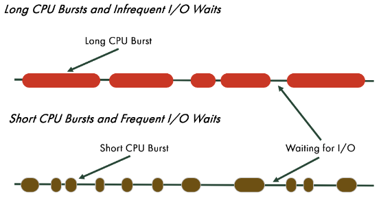
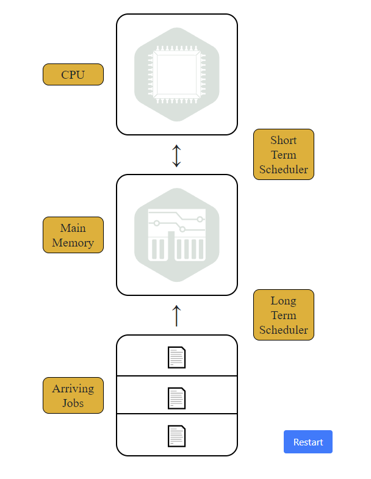
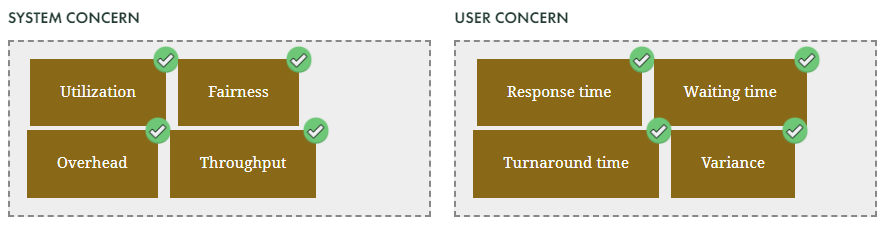

# START HERE

###### [Parent Directory Link](../README.md)

## TOC
1. [Week 1](#week-1)
    - [OS](#the-need-for-oss---11)
    - [History](#history-and-the-monitor---12)
    - [Multiprogramming](#multiprogramming---13)
    - [CPU](#using-the-cpu---14)
    - [Dual Mode](#dual-mode---15) *incomplete*
2. [Week 2](#week-2) *incomplete*
3. [Week 3](#week-3) *incomplete*
    - [Schedulers](#short-and-long-term-scheduling)
    - [NP and P Scheduling](#non-preemptive-and-preemptive-scheduling)

## Week 1

### **The need for OS's - 1.1**
###### [TOC](#toc)
The operating system is the most important piece of software on a computer.

It serves as the main go-between from user and/or applications to the machines hardware



Responsibilities of OS:
- Coordinating between different hardware components
- Handling system configurations
  - executing hardware instructions at a low level
  - this can include differing instruction sets or paradigms
- Managing independent device operation
  - Also allows for concurrent device operation
- Dealing with any specialized functionality
  - i.e. the GPU
- Handling feature creep as more options and features get added overtime

### **History and The Monitor - 1.2**
###### [TOC](#toc)

- Computers in modern form began in 1940's with Turing
- 1950's saw computers being used more and more for complicated tasks
- By the 1960's, software was finnally introduced to replace humans as the main point of interaction with the hardware
  - The start of the "operating system"
- The piece of software that runs the system is called **The monitor**
  - This is the first itteration of an operating system

*The Monitor*
- Fetches tasks from the front of the task queue
- Executes the tasks, one byt one
- Control is returned once a tasks is completed or if its execution fails
- Limitations of the monitor
  - There is no execution time limit (infinite loop problem)
  - There is no protection fror the monitor or other tasks.  Current task coul violate existing memory footprint
  - There is no ability for executing multiple tasks at once
  - The task poorly utilizes the CPU

### **Multiprogramming - 1.3**
###### [TOC](#toc)

See the diagram below for an example of no multiprgramming, i.e. sequential



Note that Task 2 cannot even start till ALL of task 1 is complete.

Basic flow for Multiprogramming:
- Run Task at top of queue
- Once tasks goes to I/O stage, surrender CPU to next task
  - Once I/O is complete, requeue the task for processing
- Execute Next task till I/O stage
- Repeat cycle

See diagram below for example of how it would work.  Note the red marks showing one task going to I/O and freeing up the processor for the next task



Multiprogramming still has limitations
- If I/O is user I/O, once the user interacts the tasks goes to back of queue
  - This would lead to bad user experience
  - Time sharing can help with this by breaking up discrete execution into "quantum" time chunks
- Unsolved issues
  - Context switching
    - Each task has an execution state
  - Memory mapping
    - Coordinating shared memory usage
  - Protection
    - Control over who can do what, and when they can do it
  - Notification
    - Error, events, quantum time period ending

### **Using the CPU - 1.4**
###### [TOC](#toc)

The advent of Mul;tiprocessor was the next jump in speed
- Multicore and Multiprocessor are the 'same' thing
  - Multicore is multiprocessor, but all on the same chip
  - The proximity of the cores allows for further speed increases

As tasks change registers, they need to remeber their state

Introducing the Memory Managment Unit (MMU)
- Tasks physical memory as "virtual" to processes
- Once assigning the virtual, it will handle pushing to the physical hardware for the task



### **Dual Mode - 1.5**
###### [TOC](#toc)

## Week 2

### **Fork and process**
###### [TOC](#toc)

Code example for fork() in C
```C
#include <unistd.h>
#include <stdio.h>
#include <stdlib.h>
#include <sys/types.h>
#include <sys/wait.h>

int main(){

  int argCounts; //can take command line or define this here
  pid_t pid[argCounts - 1]; //set up an array of process id's to be used.

  //creating the process'
  int procIDx;
  for(procIDx = 0; procIDx < argCounts-1; procIDx++){
    pid_t newPid = fork();
    if(newPID < 0){
      //error message
      //exit(1)
    }

    if(newPID > 0) {//This is the parent
      pid[procIDx] = newPid;
      //parent doesnt do any work directly
    } else { //this is the child
      //do calculations or any calls here
      exit(0); //exits the process once calcs done
    }
  }

  //do calculations or any calls here
  //no 'exit' call here like in child
  //this is the process for the top level process in the chain

  //Set wait for process' to compelte
  for(int i = 0; i < argCount - 1; i++){
    if(waitpid(pid[i], NULL, 0) == -1){
      perror("waitpid() failed");
      exit(1);
    }
  }

  exit(0); //final exit call for program
}
```

more forking examples...

```C
#include <stdlib.h> // exit() ...
#include <stdio.h> // printf() ...

// Compile with -lrt -> cc file_name.c -lrt

//#include <fcntl.h>
//#include <sys/stat.h>
//#include <sys/types.h>
//#include <sys/wait.h> // may need this for wait()
//#include <time.h>

//#include <unistd.h> // and this one for fork()

// In the start function you can do whatever you want.
void start (const int azon) {
    // For children processes
    srand( time(NULL) );
    unsigned t = rand()%5; // printf("%d\n", t);
    sleep(t);
    printf("%d. process reached the end.\n", azon);
    exit(0);
}

int main() {
    const int N = 5;
    pid_t pids[N];

    int i;

    // The 'for' loop make 'N' process with 'fork()'.
    // The children processes will call the start function.
    // Since after fork() you will get 2 process. One Parent, and One Child
    // The returning value from fork() is saved in "pids" which is an
    // integer AND it is (<0) IF something went wrong.
    //             it is (>0) IF 'we are' in the Parent process,
    // because this number is the Child process' ID (pid).
    // and Last    it is (==0) IF 'we are' in the Child process.
    for (i = 0; i < N; i++) {
        pids[i] = fork();
        sleep(1);
        if (pids[i] == 0) start(i+1); // ... OR you can make a switch(..)
    }
    // This 'for' loop in the wait(NULL) statement ONLY move on when a
    // process ended, so it waits until 'N' proc ends.
    for (i = 0; i < N; i++)
        wait(NULL);

    printf("Partent process reached the end\n");

    return 0;
}
```

## Week 3

### **Short and Long term scheduling**
###### [TOC](#toc)

**Short Term**

Short term schgedule is the process that selects the next job to be run on the cpu.

It selects tasks from available process awaiting execution.
- Preemtable resources
  - Can forcibly be removed(then returned) without ill effect
  - Characteristics
    - Small state so not costly to preempt
    - OR
    - only one resource
  - Examples:
    - CPU
    - Memory
- Non-Preemtable resources
  - You cannot take these away from a job without causing failure
  - Characteristics
    - Compicated state
    - OR
    - May need more than one instances of the resource
  - Examples:
    - CD Recorder
    - Reading/writing blocks to disk
- Shared resources
  - Include *space* and *time*
  - When sharing space, always ask "Which requests gets which resource first?"
  - When sharing time, always ask "Which requests get the resource AND when?"
- Jobs can be categorized based on above bullets

CPU vs IO bound:



- If all process are I/O bound, ready queu will almost always be empty
- If all process are CPU bound, the I/O devices are being under-utilized

**Long Term**

- Long term scheduler is for exactly as it sounds
- Real life example: Doctors Office
  - Calling weeks ahead to schedule a time/day would be the "Long Term Scheduler"
  - The receptionist that tells you to wait with other patients is "Short term"



### **Non-Preemptive and Preemptive Scheduling**
###### [TOC](#toc)

**Non-Preemptive**

**Preemptive**

System vs user concern in regards to scheduling metrics



## Week 4
## Week 5
## Week 6
## Week 7
## Week 8
## Week 9
## Week 10
## Week 11
## Week 12
## Week 13
## Week 14
## Week 15
